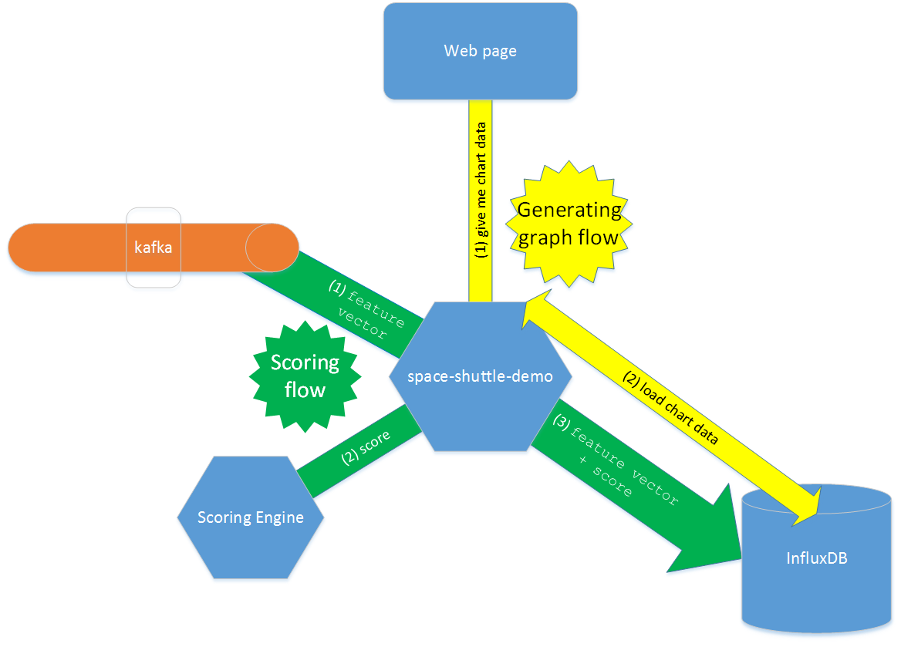

# space-shuttle-demo
Sample application for ATK space shuttle demo

## Overview


#### Scoring flow:
1. Application space-shuttle-demo listens to kafka topic and waits for feature vectors.
2. When a kafka message appears, application asks Scoring Engine to classify received feature vector.
3. Application stores scoring result in InfluxDB.

#### Generating graph flow:
1. Web application asks backend application (space-shuttle-demo) for a anomalies chart.
2. Space-shuttle-demo gets anomalies (classes different than 1) count per minute from InfluxDB.


## Deploying application to TAP
1. Create required services (of does not exist already):
    1. Instance of InfluxDB called `space-shuttle-db`
    1. Instance of Zookeeper called `zookeeper`
1. Create Java package:
  ```
  mvn package
  ```
1. Edit the auto-generated manifest.yml, if necessary (e.g. to change the application host/name)
1. Push application to the platform using command:
  ```
  cf push
  ```
1. The application is up and running, the only thing missing is the Scoring Engine location parameter (see: Scoring Engine section below)

### Scoring Engine
To set information which Scoring Engine to use, set environment variable `SE_URL`:
```
cf set-env space-shuttle SE_URL <scoring engine URL>
cf restart space-shuttle
```
**Important note:** the address of scoring engine has to be absolute URL, which means that it has to contain protocol, e.g. `http://scoring-engine.example.com`.


## Local development
#### InfluxDB
  To launch space-shuttle demo application it's best to install and run the InfluxDB locally. Instructions how to do it can be found here: http://influxdb.com/docs/v0.8/introduction/installation.html
  ```
  wget http://s3.amazonaws.com/influxdb/influxdb_latest_amd64.deb
  sudo dpkg -i influxdb_latest_amd64.deb
  ```         
  Configuration file is located at /opt/influxdb/shared/config.toml or /usr/local/etc/influxdb.conf
  There you can check or change ports used by InfluxFB. By default there will be 8083, 8086, 8090, and 8099.

  To start InfluxDB type: ```sudo /etc/init.d/influxdb start```
  
  You can then access admin panel, by default accessible at: ```localhost:8083```
  
  After going there for first time, remember to create username and password. ```root:root``` seems to be a good choice.


#### Running:

To run the application locally type:
```SE_URL=<scoring_engine_url> mvn spring-boot:run```


