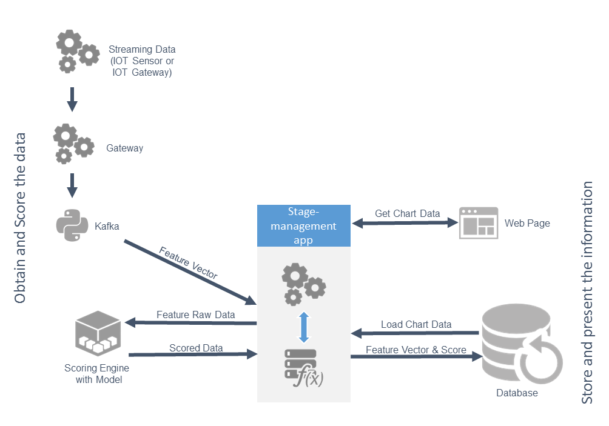

[](https://travis-ci.org/trustedanalytics/space-shuttle-demo)
[](https://www.versioneye.com/user/projects/5723704eba37ce00464e061c)

# space-shuttle-demo
This page provides instructions for using the Analytics Toolkit space shuttle demo application. The default version of this application uses Gateway and Kafka as streaming sources. If you want to use a mqtt instead go [here](mqtt/README.md)

## Overview


### Implementation summary
#### Scoring flow:
* The space-shuttle-demo application listens to the Kafka topic and waits for feature vectors.
* When a Kafka message appears, the application asks the Scoring Engine to classify the received feature vector.
* The application stores the scoring result in an InfluxDB database.

#### Generating graph flow:
* The web application asks the backend application (space-shuttle-demo) for an anomalies chart.
* The space-shuttle-demo application fetches anomalies (classes different than 1) several times per minute from InfluxDB and then displays them.

## Deploying application to TAP
   
### Manual deployment
1. Upload the model to HDFS: 
   * Download the pre-packaged model from: [https://s3.amazonaws.com/trustedanalytics/v0.7.1/models/space-shuttle-model.tar](https://s3.amazonaws.com/trustedanalytics/v0.7.1/models/space-shuttle-model.tar)
   * Login to the TAP console and navigate to  **Data catalog > Submit Transfer**.
   * Select input type: **Local path** and choose the previously downloaded model.
   * Enter a title in the **Title** field.
   * Click the **Upload** button. 
   
   Alternatively, you can create the TAP Analytics Toolkit model yourself. Refer to the [instructions](#creating-tap-analytics-toolkit-model) later on this page.
   
1. Create the required service instances (if they do *not* exist already). The application will connect to these service instances using Spring Cloud Connectors. **Note:** If you use the recommended names for the required service instances, they will be bound automatically with the application when it is pushed to Cloud Foundry. Otherwise, service instance names will need to be either (1) adjusted in the 'manifest.yml' file or (2) removed from 'manifest.yml' and bound manually after the application is pushed to Cloud Foundry.
    * Instance of InfluxDB (recommended name: ‘space-shuttle-db’).
    * Instance of Zookeeper (recommended name: ‘space-shuttle-zookeeper’).
    * Instance of Gateway (recommended name: ‘space-shuttle-gateway’).
    * Instance of Scoring Engine with recommended name: ‘space-shuttle-scoring-engine’. The next step provides instructions to create the Scoring Engine service instance.

    To create the Scoring Engine service instance:
    * From the TAP console, navigate to **Services > Marketplace**. Select the “TAP Scoring Engine” service.
    * Type the name ‘space-shuttle-scoring-engine’
    * Click **+ Add an extra parameter** and add the TAP Analytics Toolkit model url: ‘key: uri value: hdfs://path_to_model'.
    * Click the **Create new instance** button.

1. Create a Java package:
  ```
  mvn package
  ```
1. (Optional) If you created service instances with different names than were recommended, edit the auto-generated 'manifest.yml' file to adjust the names of service instances in the services section to match those that you've created. You can also remove the services section and bind them manually later. You may also want to change the application host/name.
1. Push the application to the platform using the Cloud Foundry (CF)  command:  ‘cf push’.
1. (Optional) If you removed the services section from ‘manifest.yml’, the application will *not* be started yet. First, bind the required service instances (‘cf bind-service’) to the application and then restage (‘cf restage’) it.
1. The application is now up and running. You should see the space shuttle image appear followed by anomaly data being displayed.

### Automated deployment
1. Switch to the ‘deploy’ directory using: ‘cd deploy’
1. Download [the model](https://s3.amazonaws.com/trustedanalytics/v0.7.1/models/space-shuttle-model.tar) and rename it to ‘model.tar’.
1. Install tox: ‘sudo -E pip install --upgrade tox’
1. Run: ‘tox’
1. Activate virtualenv with installed dependencies: ‘. .tox/py27/bin/activate’
1. Run the deployment script: ‘python deploy.py’; the script will use parameters provided on input. Alternatively, provide parameters when running the script. (python deploy.py -h to check script parameters and their descriptions).

## Sending data to Kafka

To send data to Kafka through a gateway you can either (1) push space_shuttle_client from the client directory to the space with the existing gateway instance or (2) use the Python file ‘space_shuttle_client.py’, locally passing the Gateway url as a parameter.

### Running on Cloud Foundry:

1. Login to the space containing space-shuttle-gateway
1. Go to: ‘client/’
1. Push the app to Cloud Foundry using: ‘cf push’ 
>Note: In case of name conflict during the push, add the name parameter ‘cf push <custom_name>’

### Local configuration:

#### Prerequisites:

1. Python 2.7
1. tox ([installation details](http://tox.readthedocs.io/en/latest/install.html))

### Gateway URL
To determine the URL of the gateway you are going to send data to:

1. From the TAP console, navigate to **Applications**.
1. Search for space-shuttle-gateway
1. Copy the application URL.

### Running Python client locally:
1. Go to: ‘client/’
1. Run tox: ‘tox’
1. Activate created virtualenv: ‘. .tox/py27/bin/activate’
1. Run: ‘python space_shuttle_client.py --gateway-url <gateway_url>’

##Creating TAP Analytics Toolkit model
To create the model for the Scoring Engine, follow these steps:

#### Upload training data set to HDFS
1. Login to the TAP console and navigate to  **Data catalog > Submit Transfer**. 
1. Select the input type: **Local path**.
1. Select the sample training data file, which can be found here: src/main/atkmodelgenerator/train-data.csv)
1. Enter a title in the **Title** field.
1. Click the **Upload** button.
When the upload is completed, click the **Data sets** tab and view the details of the uploaded data set by clicking its name. Copy the value of targetUri, which contains the path to the uploaded data set in HDFS; you will need this to create the TAP Analytics Toolkit model in Jupyter notebook.

#### Create Analytics Toolkit instance
1. In the TAP console, navigate to the **Data Science >TAP Analytics Toolkit** tab.
1. If there is an instance of TAP Analytics Toolkit already installed, you will see it in an instances list; no further action is needed. If there are *no* instances, you will be asked if you want to create one. Select **Yes**, then wait until the application is created (this can take about a minute or two). The application will appear in the **TAP Analytics Toolkit** instances list after creation.

#### Create Jupyter instance
1. In the TAP console, navigate to the **Data Science > Jupyter**. Click the **Create a new Jupyter instance** button.
1. Copy the password for the newly created Jupyter instance (for use in the next step).
1. Login to Jupyter by clicking the App Url link, using the password you just copied.

#### Install TAP Analytics Toolkit client
1. Create a new Jupyter notebook (see the steps above).
1. Install the TAP Analytics Toolkit client in your notebook by executing this command: ‘!pip install <link-to-atk-server>/client’. <link-to-atk-server> can be copied from the URL column in the **TAP Analytics Toolkit** instances list.

#### Connect to TAP Analytics Toolkit server and run model generation script
1. Copy the contents from ‘src/main/atkmodelgenerator/atk_model_generator.py’ into your notebook.
1. After the imports section, set the URI to the TAP Analytics Toolkit server: ‘ta.server.uri = <link-to-atk-server>’
1. Set the value of ‘ds’ to be the link to the data set previously uploaded to HDFS (‘targetUri’).
1. Run the script. The link to the created model in HDFS will be printed in the output.

## Local development
The application can be run in three different configurations depending on chosen data provider (streaming source).

* There is one special Spring @Profile (local), which was created to enable local development.
* cloud, Kafka, and mqtt profiles should be inactive when doing local development.
* random profile should be active instead while local development. It uses a simple random number generator instead of streaming source like Kafka or mqtt.

>Note: Streaming data during local development is random numbers, so this generates a lot of anomalies.

### Local Configuration
#### Prerequisites
##### InfluxDB
1. Instructions to install and run InfluxDB are provided here: http://influxdb.com/docs/v0.8/introduction/installation.html
1. The easiest way is to run InfluxDB is in inside a docker container: docker run -d -p 8083:8083 -p 8086:8086 tutum/influxdb:0.8.8.

>Note: influxdb:0.9 is *not* backwards compatible with 0.8.x.

   
##### Scoring Engine  
For instructions on pushing the scoring engine to the platform, go [here[(https://github.com/trustedanalytics/space-shuttle-demo#manual-deployment).  

  
#### Run
1. Make sure that both local and random profiles are active.
1. ‘export SE_URL <scoring engine URL>’
     **Note:** The link should not contain  the ‘http:// protocol’
1. ‘mvn spring-boot:run’
1. In a web browser, enter ‘localhost:8080’
